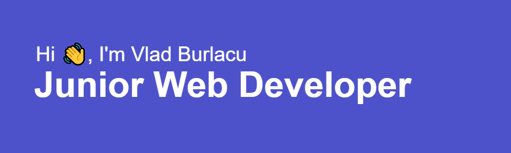

 

## 🙋‍♂️ About me

My name is Vlad Burlacu, I'm an aspiring Junior Fullstack Web Developer. Originally a Sushi Chef, I decided to change
professions and become a Web Developer. So here I am! Working and studying hard to make my newly found passion
a career path and dive into the world of web development.

- 🔭 I’m currently working on <a href="https://github.com/VladBurlacu/Discovering-Laravel">Discovering Laravel</a>.</li>
- 🧐 I’m working on several projects, trying to improve my knowledge and skills</li>
- 📫 How to reach me:
- 📫 [email](mailto:vladburlacu1337@gmail.com)
- 📫 Discord: Dracula#1883

### 🧑🏼‍💻 Languages I used in my projects 🧩

<table>
      <thead align="center" style="text-align:center">
        <th align="center" style="text-align:center">HTML</th>
        <th align="center" style="text-align:center">CSS</th>
        <th align="center" style="text-align:center">JavaScript</th>
        <th align="center" style="text-align:center">PHP</th>
        <th align="center" style="text-align:center">TypeScript</th>
        <th align="center" style="text-align:center">Bash</th>
      </thead>
      <tbody>
        <td align="center" style="text-align:center">
          
        </td>
        <td align="center" style="text-align:center" >
          
        </td>
        <td align="center" style="text-align:center">
          
        </td>
        <td align="center" style="text-align:center">
          
        </td>
        <td align="center" style="text-align:center"></td>
        <td align="center" style="text-align:center"></td>
      </tbody>
</table>

### ⚒️ Tools I used in my projects 🛠

<table>
      <thead align="center" style="text-align:center">
        <th align="center" style="text-align:center">SASS</th>
        <th align="center" style="text-align:center">TailwindCSS</th>
        <th align="center" style="text-align:center">ReactJS</th>
        <th align="center" style="text-align:center">Angular</th>
        <th align="center" style="text-align:center">ExpressJS</th>
        <th align="center" style="text-align:center">Symfony</th>
        <th align="center" style="text-align:center">Git</th>
      </thead>
      <tbody>
        <td align="center" style="text-align:center">
          
        </td>
        <td align="center" style="text-align:center">
          
        </td>
        <td align="center" style="text-align:center">
          
        </td>
        <td align="center" style="text-align:center">
          
        </td>
        <td align="center" style="text-align:center;background-color:smokewhite;">
          
        </td>
        <td align="center" style="text-align:center">
          
        </td>
        <td align="center" style="text-align:center; background-color:smokewhite;">
          
        </td>
        <td align="center" style="text-align:center; background-color:smokewhite;">
          
        </td>
      </tbody>
</table>

<!--
**VladBurlacu/VladBurlacu** is a ✨ _special_ ✨ repository because its `README.md` (this file) appears on your GitHub profile.

Here are some ideas to get you started:

- 🔭 I’m currently working on ...
- 🌱 I’m currently learning ...
- 👯 I’m looking to collaborate on ...
- 🤔 I’m looking for help with ...
- 💬 Ask me about ...
- 📫 How to reach me: ...
- 😄 Pronouns: ...
- ⚡ Fun fact: ...
-->
